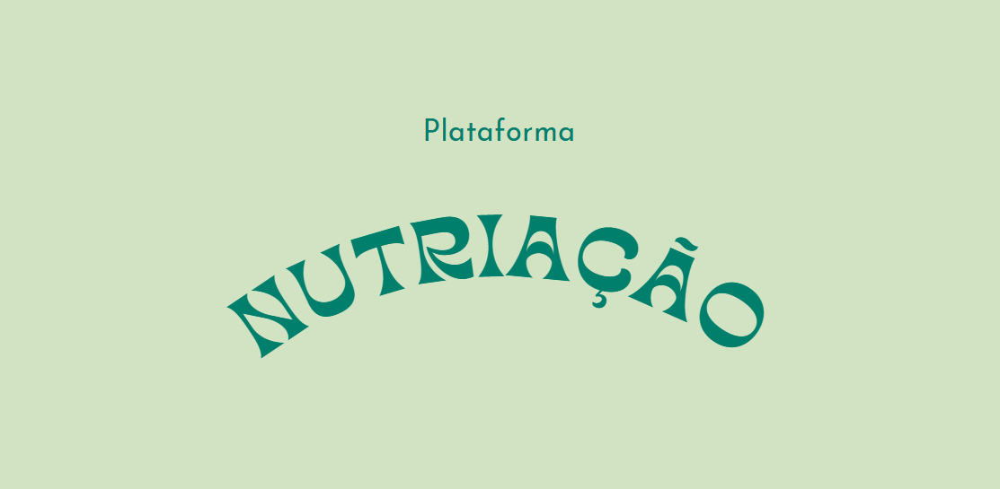

<p align="center">
Uma plataforma para empresas do ramo alimentícios, e ONGs responsáveis por doar alimentos ou alimentar pessoas em vulnerabilidade social. No qual a empresa doará alimentos para essas ongs que precisam de doações.
</p>
  <!--[](https://opencollective.com/nest#backer)
  [](https://opencollective.com/nest#sponsor)-->

## Contexto

Atualmente vemos um grande número de alimentos em bom estado sendo desperdiçados e jogados fora no ramo alimentício.
Por outro lado, pessoas em vulnerabilidade social não conseguem se alimentar de maneira saudável por não ter acesso a esses alimentos , ou não tem com o que se alimentar.
Existem ONGs que auxiliam esse grupo social mas muitas vezes precisam de um grande número de doações, e o ramo alimentício pode de certa forma contribuir com essa necessidade.

## Público alvo
Empresas do ramo alimentício e ongs que alimentam pessoas em vulnerabilidade social.

## Tecnologias utilizadas
- NestJS
- PostgreSQL
- NodeJS
- TypeScript
- Git/Github

## Funcionalidades
- Cadastrar empresas
- Cadastrar ongs
- Cadastrar doações
- Cadastrar agentes de empresas e ongs

## Funcionalidades secundárias
- Histórico de doações que foram realizadas pela empresa
- A organização poderá enviar um feedback sobre a doação
- Atribuir os agentes (empresa e ong) em cada processo de doação

## Como instalar e executar o projeto

```bash
$ npm install
```

### Compile os comandos

```bash
# development
$ npm run start

# watch mode
$ npm run start:dev

# production mode
$ npm run start:prod
```
